# IAM Least Privilege Guide

## Why this document exists

I use AWS Identity and Access Management (IAM) so each service in the platform can do its own job and nothing extra. This is the same security idea across the whole platform:

```text
Give each service the smallest useful set of permissions.
Do not give broad access just because it is easier.
```

This document explains the intent behind the Terraform IAM policies in clear, direct language. The Terraform files remain the source of truth, but this page should make the design easier to review before I change anything.

## The simple mental model

IAM has two separate ideas:

```text
Authentication: who is calling?
Permission: what is that caller allowed to do?
```

For example:

```text
Authentication:
The Analytics Agent is running as its ECS task role.

Permission:
That role can query Athena, read Gold metadata, write audit logs, and call Claude.
```

The role proves identity. The policy limits behavior.

## Platform permission map

```mermaid
flowchart TD
    ECSAgent[Analytics Agent ECS task role]
    StepFn[Step Functions role]
    Glue[Glue job role]
    MWAA[MWAA execution role]
    DMS[DMS service roles]
    Lambda[Lambda roles where used]

    ECSAgent --> Athena[Query Amazon Athena]
    ECSAgent --> Gold[Read Gold data and metadata]
    ECSAgent --> Audit[Write agent audit and engineer logs to S3]
    ECSAgent --> Claude[Call Claude Platform on AWS]

    StepFn --> GlueStart[Start Glue jobs]
    StepFn --> DBT[Run dbt orchestration task]
    StepFn --> Logs[Write execution logs]

    Glue --> Bronze[Read Bronze data]
    Glue --> Silver[Write Silver data]
    Glue --> Catalog[Read and update Glue Data Catalog]
    Glue --> JobLogs[Write CloudWatch Logs]

    MWAA --> AirflowDAG[Run the Airflow DAG]
    MWAA --> GlueFromDAG[Start Glue jobs]
    MWAA --> AthenaDBT[Run dbt through Athena]
    MWAA --> S3Artifacts[Read DAG and dbt artifacts from S3]

    DMS --> RDS[Read from RDS source]
    DMS --> Landing[Write change data capture files to S3]

    Lambda --> Specific[Only service-specific actions]
```



## Analytics Agent

The Analytics Agent should be one of the most tightly scoped services because it sits close to business users.

Its role should allow:

```text
- Read Gold table metadata from the Glue Data Catalog.
- Run SELECT-only Athena queries against Gold data.
- Read Athena query results needed for the current request.
- Write audit logs and engineer logs to the approved Simple Storage Service (S3) metadata paths.
- Call Claude for SQL generation, insight writing, and verdict checking.
```

It should not allow:

```text
- Writing to Gold business tables.
- Reading raw database credentials.
- Running destructive SQL.
- Accessing unrelated S3 buckets or prefixes.
- Managing Claude workspaces, users, API keys, agents, memory, or tools.
```

## Claude Platform on AWS

Claude Platform on AWS should use the same least-privilege model as Athena and S3.

The caller is:

```text
Analytics Agent ECS task role
```

The allowed behavior is:

```text
Create Claude inference requests.
Count Claude tokens.
Only use the Analytics Agent Claude workspace for the current environment.
```

The role should not get broad Claude administration permissions.

The intended policy shape is:

```json
{
  "Effect": "Allow",
  "Action": [
    "aws-external-anthropic:CreateInference",
    "aws-external-anthropic:CountTokens"
  ],
  "Resource": "arn:aws:aws-external-anthropic:eu-central-1:<account-id>:workspace/<workspace-id>"
}
```

This belongs in the Analytics Agent Terraform module because that module owns the ECS task role used by the running service. The workspace ID comes from SSM Parameter Store so Terraform does not hardcode environment-specific Claude identifiers.

## Step Functions

The Step Functions role should orchestrate the default data pipeline. It should allow:

```text
- Starting the approved Glue jobs.
- Running the dbt step used by the pipeline.
- Passing only the approved roles needed by those tasks.
- Writing state machine execution logs.
```

It should not allow:

```text
- Broad IAM administration.
- Starting unrelated jobs.
- Reading or writing unrelated buckets.
```

## Glue jobs

Glue job roles should allow data transformation and catalog updates only for the platform datasets.

They should allow:

```text
- Read Bronze data.
- Write Silver data.
- Read and update the Glue Data Catalog entries needed by the jobs.
- Write job logs to Amazon CloudWatch Logs.
```

They should not allow:

```text
- Reading unrelated buckets.
- Managing IAM users or roles.
- Managing networking resources.
```

## MWAA

Amazon Managed Workflows for Apache Airflow (MWAA) is kept in sync with Step Functions, but it is not the default daily orchestrator.

The MWAA execution role should allow:

```text
- Reading Directed Acyclic Graph (DAG), plugin, requirement, and dbt artifacts from S3.
- Starting the same approved Glue jobs as the Step Functions path.
- Running dbt through Athena.
- Reading and updating only the metadata needed for the DAG.
- Writing Airflow logs.
```

It should not allow:

```text
- Broad KMS key administration.
- Broad S3 access.
- Glue job changes outside the platform pipeline.
```

## DMS

Database Migration Service (DMS) needs narrowly scoped service roles because it moves change data capture data from the source database to S3.

It should allow:

```text
- Reading from the Relational Database Service (RDS) source through the configured connection.
- Writing change data capture output to the approved S3 landing prefix.
- Writing DMS logs.
```

It should not allow:

```text
- Reading unrelated databases.
- Writing outside the landing path.
- Managing unrelated AWS services.
```

## Review checklist

Before I add or change an IAM permission, I should be able to answer these questions:

```text
Which role receives the permission?
Which exact service action does it need?
Which resource is the smallest safe scope?
Can the permission be limited to one environment?
Can the permission be limited to one bucket prefix, database, table, workspace, or job?
What breaks if this permission is removed?
Could this permission write, delete, or administer something unexpectedly?
```

If the answer is unclear, the permission is probably too broad or the design is not ready yet.
