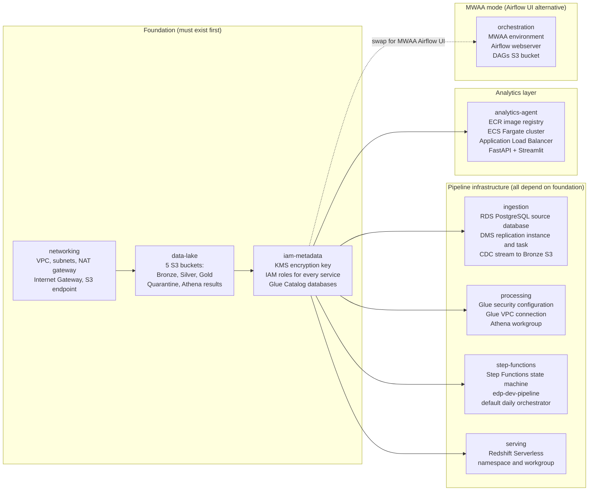
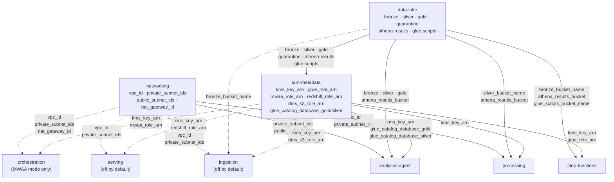
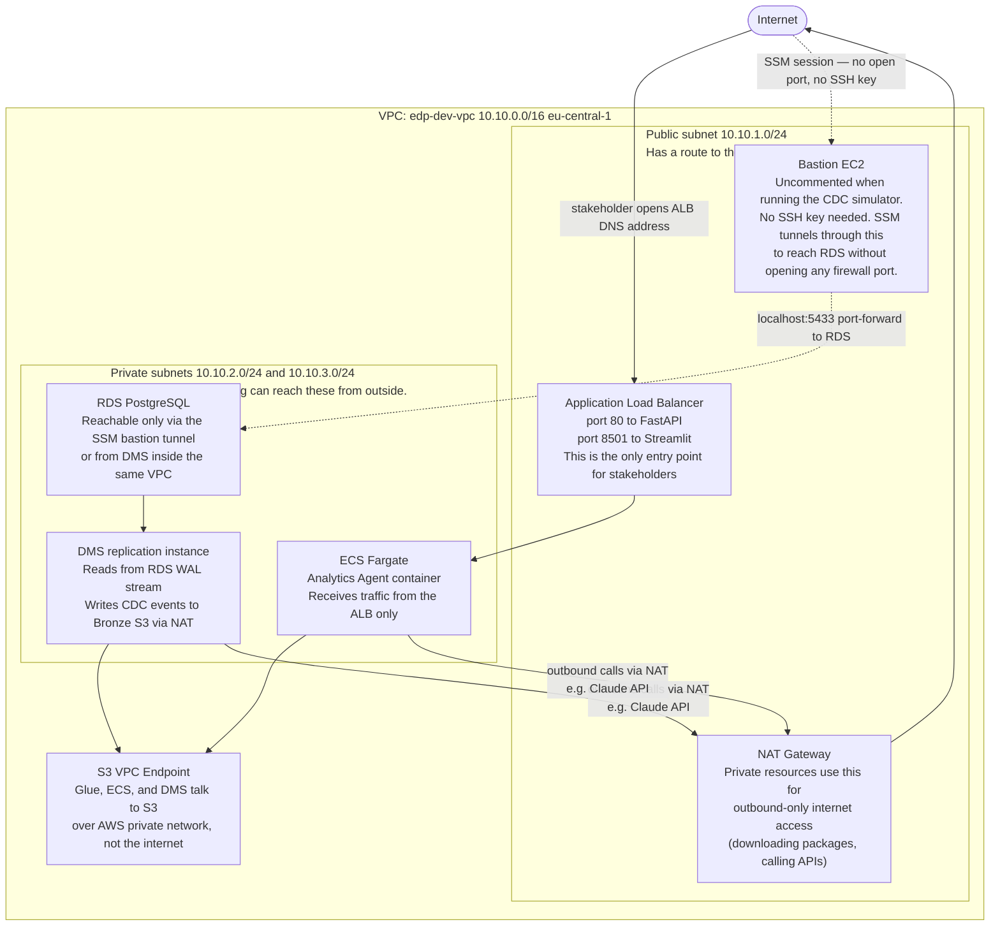
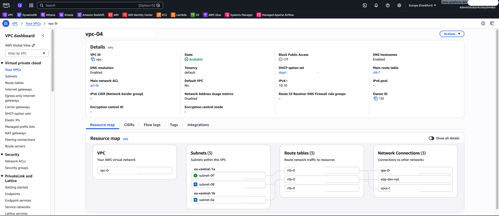
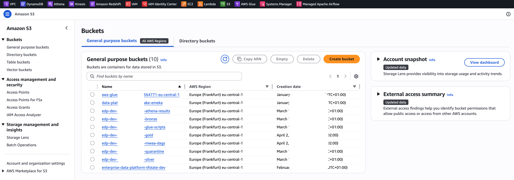

# terraform-platform-infra-live

This repository is part of the [Enterprise Data Platform](https://github.com/enterprise-data-platform-emeka/platform-docs). For the full project overview, architecture diagram, and build order, start there.

**Previous:** [terraform-bootstrap](https://github.com/enterprise-data-platform-emeka/terraform-bootstrap): that repo created the S3 remote state backend and OIDC roles this infrastructure needs to store Terraform state and authenticate CI/CD.

---

This repository contains all the AWS (Amazon Web Services) infrastructure for the Enterprise Data Platform, written as Terraform code. If the `terraform-bootstrap` repository creates the filing cabinet (remote state storage), this repository builds everything inside it: the private network, the data storage buckets, the encryption keys, the permissions, the databases, the data processing environment, the data warehouse, the pipeline orchestration system, and the serving layer for the Analytics Agent.

Every AWS resource this platform needs is defined here. Nothing is created manually in the AWS console.

---

## Contents

- [How it all fits together](#how-it-all-fits-together)
- [What lives in this repository](#what-lives-in-this-repository)
- [The nine modules and what they create](#the-nine-modules-and-what-they-create)
- [Module dependency order](#module-dependency-order)
- [Which modules are active by default in dev](#which-modules-are-active-by-default-in-dev)
- [Network topology](#network-topology)
- [Using the Makefile](#using-the-makefile)
- [Sensitive variables](#sensitive-variables)
- [Important deployment notes](#important-deployment-notes)
- [Inspecting created resources in the AWS console](#inspecting-created-resources-in-the-aws-console)
- [Infrastructure screenshots](#infrastructure-screenshots)
- [Full validation checklist](#full-validation-checklist)
- [Environments](#environments)
- [CI/CD](#cicd)
- [Module READMEs](#module-readmes)

---

## How it all fits together

Nine Terraform modules build the complete platform in dependency order. The diagram below shows how each module relates to the others and what part of the data pipeline it enables.



---

## What lives in this repository

The infrastructure is organized as modules. Each module has one job and creates a specific group of related resources. The modules are called from environment folders (dev, staging, prod), where environment-specific values are passed in.

```
terraform-platform-infra-live/
│
├── Makefile                          Shortcuts for common Terraform commands
│
├── modules/
│   ├── networking/                   VPC, subnets, route tables, S3 endpoint
│   ├── data-lake/                    Five S3 data lake buckets
│   ├── iam-metadata/                 KMS key, IAM roles, Glue Catalog databases
│   ├── ingestion/                    RDS PostgreSQL database and DMS replication
│   ├── processing/                   Glue security config and Athena workgroup
│   ├── serving/                      Redshift Serverless namespace and workgroup
│   ├── step-functions/               Step Functions state machine (default daily orchestrator)
│   ├── orchestration/                MWAA environment (Airflow UI alternative)
│   └── analytics-agent/              ECR, ECS Fargate cluster, ALB for the Analytics Agent
│
└── environments/
    ├── dev/
    │   ├── main.tf                   Calls all modules with dev-specific values
    │   ├── variables.tf              Input variable definitions for dev
    │   ├── providers.tf              AWS provider configuration
    │   ├── versions.tf               Terraform and provider version locks
    │   └── backend.tf                Remote state backend (S3 + DynamoDB)
    │
    ├── staging/                      Same structure as dev
    └── prod/                         Same structure as dev
```

---

## The nine modules and what they create

| Module | Resources created |
|---|---|
| networking | VPC (Virtual Private Cloud), public subnet, two private subnets, Internet Gateway, NAT (Network Address Translation) Gateway, route tables, S3 VPC Endpoint |
| data-lake | Five S3 (Simple Storage Service) buckets: Bronze, Silver, Gold, Quarantine, Athena results |
| iam-metadata | KMS (Key Management Service) encryption key, IAM (Identity and Access Management) roles for Glue/MWAA/Redshift/DMS, three Glue Catalog databases. Note: the GitHub Actions OIDC provider and deploy roles live in `terraform-bootstrap`, not here. |
| ingestion | RDS (Relational Database Service) PostgreSQL database, DMS (Database Migration Service) replication instance, DMS source and target endpoints, DMS replication task |
| processing | Glue security configuration (KMS encryption for bookmarks and logs), Glue VPC connection, Athena workgroup |
| serving | Redshift Serverless namespace and workgroup |
| step-functions | AWS Step Functions state machine for daily pipeline execution, IAM role for Step Functions, `run_dbt` Glue Python Shell job, CloudWatch log group. **Default orchestrator** — enabled in all environments. |
| orchestration | MWAA (Amazon Managed Workflows for Apache Airflow) environment, DAGs S3 bucket, CloudWatch log groups. **Optional Airflow UI orchestrator** — runs the same pipeline as Step Functions with a visual task graph. Comment out `step_functions` and uncomment `orchestration` in `environments/dev/main.tf` to switch. |
| analytics-agent | ECR (Elastic Container Registry) image repository, ECS (Elastic Container Service) Fargate cluster, ECS task definition and service, ALB (Application Load Balancer) with listeners for FastAPI (port 80) and Streamlit (port 8501), IAM task execution role and task role, CloudWatch log group |

---

## Module dependency order

The modules must be applied in this order. The diagram below shows every actual output-to-input connection — edge labels are the exact Terraform output names. Solid lines are always-on modules; dashed lines are modules commented out by default.



**Why this order:**

- `networking` has no dependencies. It creates the VPC (Virtual Private Cloud), subnets, and NAT Gateway that every other module runs inside.
- `data-lake` creates the 6 S3 buckets. All six bucket names are passed directly to `iam-metadata` so IAM roles can be scoped to specific bucket ARNs. Several bucket names are also passed directly to leaf modules.
- `iam-metadata` creates IAM roles using the bucket names from `data-lake`. The roles grant Glue, DMS, MWAA, and Redshift access to specific buckets. It also creates the KMS (Key Management Service) encryption key used by everything below.
- `processing`, `step-functions`, and `analytics-agent` each receive outputs from all three foundation modules: VPC/subnet IDs from `networking`, specific bucket names from `data-lake`, and `kms_key_arn` plus role ARNs from `iam-metadata`. They can be applied in any order relative to each other once `iam-metadata` exists.

**Output reference — what each module's outputs feed into:**

| Output | Source module | Consumed by |
|---|---|---|
| `vpc_id` | networking | processing, analytics-agent, (ingestion, serving, orchestration) |
| `private_subnet_ids` | networking | processing, analytics-agent, (ingestion, serving, orchestration) |
| `public_subnet_ids` | networking | analytics-agent |
| `nat_gateway_id` | networking | (orchestration) |
| `bronze_bucket_name` | data-lake | iam-metadata, step-functions, analytics-agent, (ingestion) |
| `silver_bucket_name` | data-lake | iam-metadata, processing, analytics-agent |
| `gold_bucket_name` | data-lake | iam-metadata, analytics-agent |
| `quarantine_bucket_name` | data-lake | iam-metadata |
| `athena_results_bucket` | data-lake | iam-metadata, processing, step-functions, analytics-agent |
| `glue_scripts_bucket_name` | data-lake | iam-metadata, step-functions |
| `kms_key_arn` | iam-metadata | processing, step-functions, analytics-agent, (ingestion, serving, orchestration) |
| `glue_role_arn` | iam-metadata | step-functions |
| `dms_s3_role_arn` | iam-metadata | (ingestion) |
| `redshift_role_arn` | iam-metadata | (serving) |
| `mwaa_role_arn` | iam-metadata | (orchestration) |
| `glue_catalog_database_gold` | iam-metadata | analytics-agent |
| `glue_catalog_database_silver` | iam-metadata | analytics-agent |

Entries in parentheses are for modules that are commented out by default in `environments/dev/main.tf`.

---

## Which modules are active by default in dev

Not every module runs in every session. `environments/dev/main.tf` uses comments to switch between configurations depending on what's being tested.

| Module | Default state in dev | When to change it |
|---|---|---|
| networking | active | Always on |
| data-lake | active | Always on |
| iam-metadata | active | Always on |
| processing | active | Always on |
| step-functions | active | Comment out only when switching to MWAA mode |
| analytics-agent | active | Always on |
| ingestion | **commented out** | Uncomment when running the CDC simulator against AWS RDS |
| serving | **commented out** | Uncomment when querying Gold data directly from Redshift |
| orchestration | **commented out** | Uncomment (and comment out step-functions) to use MWAA Airflow orchestration with a visual task graph |

The reason `ingestion` is commented out by default: the RDS instance and DMS task cost money to run ($0.02/hr for RDS, $0.10/hr for DMS). After the initial CDC (Change Data Capture) run that populated Bronze S3, the Bronze data persists between sessions. I only uncomment `ingestion` when I need to run the CDC simulator again.

---

## Network topology

The platform uses a standard VPC isolation pattern. Resources that should be reachable from the internet live in the public subnet. Everything else lives in private subnets with no inbound internet route.



**Why private subnets?** RDS holds the source OLTP (Online Transaction Processing) data. Putting it in a private subnet means it has no internet-facing address. The only way to reach it is through the bastion, which requires AWS SSO (Single Sign-On) credentials — no static passwords or open ports.

---

## Using the Makefile

I use a Makefile to avoid typing long Terraform commands with directory paths every time.

| Command | What it runs |
|---|---|
| `make init dev` | `cd environments/dev && terraform init` |
| `make plan dev` | `cd environments/dev && terraform plan` |
| `make apply dev` | `cd environments/dev && terraform apply` |
| `make destroy dev` | `cd environments/dev && terraform destroy` |

Replace `dev` with `staging` or `prod` for other environments. Always log in to AWS SSO before running any of these.

```bash
aws sso login --profile dev-admin
make init dev
make plan dev
make apply dev
```

---

## Sensitive variables

Two variables have no defaults and must be provided at apply time. Never put these in a `.tf` file or commit them to Git.

| Variable | What it is |
|---|---|
| `db_password` | The master password for the RDS PostgreSQL database |
| `redshift_admin_password` | The admin password for the Redshift Serverless namespace |

**Recommended — environment variables:**

```bash
export TF_VAR_db_password="YourSecurePassword123!"
export TF_VAR_redshift_admin_password="AnotherSecurePassword456!"
make apply dev
```

Terraform reads any `TF_VAR_*` environment variable and maps it to the matching variable.

**After `make apply dev` completes**, both passwords are automatically stored in AWS SSM (Systems Manager) Parameter Store as encrypted `SecureString` parameters:

| SSM path | What it stores |
|---|---|
| `/edp/dev/rds/db_password` | RDS PostgreSQL master password |
| `/edp/dev/redshift/admin_password` | Redshift Serverless admin password |

From that point on, no tool (simulator, Airflow DAG, script) ever needs a password file. They fetch the value from SSM at runtime using the `dev-admin` AWS profile.

**Alternative — tfvars file (excluded from Git):**

```bash
# Create environments/dev/secret.tfvars
# Add this file to .gitignore

db_password             = "YourSecurePassword123!"
redshift_admin_password = "AnotherSecurePassword456!"

# Apply with:
terraform apply -var-file="secret.tfvars"
```

---

## Important deployment notes

### 1. Apply iam-metadata before ingestion

The DMS (Database Migration Service) service requires two IAM roles with fixed names to exist before I can create a replication instance:

- `dms-vpc-role` — allows DMS to create network interfaces in the VPC
- `dms-cloudwatch-logs-role` — allows DMS to write logs to CloudWatch

These roles are created by the `iam-metadata` module. If I try to apply `ingestion` before `iam-metadata`, the DMS replication instance creation will fail.

### 2. The two fixed DMS role names

AWS DMS looks for exactly these role names in every account. The names cannot be changed. If these roles already exist in the AWS account from a previous deployment, Terraform will fail when trying to create them again because they already exist.

In that case, import them into Terraform state:

```bash
terraform import module.iam_metadata.aws_iam_role.dms_vpc dms-vpc-role
terraform import module.iam_metadata.aws_iam_role.dms_cloudwatch dms-cloudwatch-logs-role
```

After importing, Terraform knows these resources already exist and will manage them without trying to recreate them.

### 3. RDS reboot after first apply

The RDS PostgreSQL instance needs logical replication mode enabled for CDC to work. This is set in the parameter group, but the parameter requires a database restart to take effect.

After the first `terraform apply`, reboot the RDS instance:

```bash
aws rds reboot-db-instance \
  --db-instance-identifier edp-dev-source-db \
  --profile dev-admin
```

Wait for the instance to return to `available` status before proceeding.

### 4. Start the DMS task manually

After the infrastructure is applied and the RDS instance has been rebooted, the DMS replication task needs to be started manually. Terraform creates the task but does not start it.

```bash
aws dms start-replication-task \
  --replication-task-arn <task_arn_from_terraform_output> \
  --start-replication-task-type start-replication \
  --profile dev-admin
```

The task ARN is in the Terraform output after `make apply dev`.

---

## Inspecting created resources in the AWS console

After `make apply dev` completes, I can verify what Terraform built in two ways. Both require being logged in to the correct AWS account and being in the **eu-central-1 (Frankfurt)** region. The region selector is in the top-right corner of every AWS console page.

---

### Method 1: Tag Editor (fastest — everything in one view)

Tag Editor searches across all AWS resource types and returns every resource that matches a given tag. Because Terraform tags every resource with `Project = EnterpriseDataPlatform`, a single search shows the full inventory without clicking through multiple service consoles.

**Steps:**

1. Open the AWS console and go to **Resource Groups and Tag Editor**. I can find it by typing "Tag Editor" in the top search bar.
2. Click **Tag Editor** in the left sidebar.
3. Set the search fields:
   - **Regions:** `eu-central-1`
   - **Resource types:** leave as "All resource types"
   - **Tags:** Key = `Project`, Value = `EnterpriseDataPlatform`
4. Click **Search resources**.

Every resource Terraform created appears in the results list with its type, name, region, and ARN (Amazon Resource Name). I can sort by resource type to group related resources together.

**When to use this method:** when I want to confirm everything was created and nothing is missing, or when I want a quick count of total resources before running `make destroy dev`.

---

### Method 2: Service by service (most detail)

This method goes directly to each service's console for the richest view of each resource. It takes longer but shows configuration details, connection status, and metrics that Tag Editor does not.

**Always check that the region is set to eu-central-1 before navigating to any service.**

| Service | Console path | What to look for |
|---|---|---|
| VPC (Virtual Private Cloud) | VPC → Your VPCs | `edp-dev-vpc`, 3 subnets, S3 VPC Endpoint on private route table |
| S3 (Simple Storage Service) | S3 → Buckets | 5 buckets with `edp-dev-` prefix, encryption and versioning enabled on each |
| RDS (Relational Database Service) | RDS → Databases | `edp-dev-source-db` showing status `available` (only if ingestion module is enabled) |
| DMS (Database Migration Service) | DMS → Replication instances / Tasks | `edp-dev-dms-ri` showing `available`, `edp-dev-cdc-task` visible (only if ingestion module is enabled) |
| EC2 (Elastic Compute Cloud) | EC2 → Instances | `edp-dev-bastion` showing `running` (only if ingestion module is enabled) |
| KMS (Key Management Service) | KMS → Customer managed keys | Key with alias `alias/edp-dev-platform` |
| IAM (Identity and Access Management) | IAM → Roles, filter by `edp` | All service roles for Glue, MWAA, Redshift, DMS |
| Glue | Glue → Databases | `edp_dev_bronze`, `edp_dev_silver`, `edp_dev_gold` |
| Athena | Athena → Workgroups | `edp-dev-workgroup` showing `ENABLED` |
| Redshift Serverless | Redshift Serverless → Workgroups | `edp-dev-workgroup` and `edp-dev-namespace` (only if serving module is enabled) |
| Step Functions | Step Functions → State machines | `edp-dev-pipeline` showing Active status |
| ECR (Elastic Container Registry) | ECR → Repositories | `edp-dev-analytics-agent` repository |
| ECS (Elastic Container Service) | ECS → Clusters | `edp-dev-agent-cluster` with one running Fargate service |
| EC2 → Load Balancers | EC2 → Load Balancers | `edp-dev-agent-alb` in Active state |
| SSM (Systems Manager) | Systems Manager → Parameter Store | `/edp/dev/rds/db_password` and `/edp/dev/redshift/admin_password` as `SecureString` |

**When to use this method:** when verifying a specific resource in detail, troubleshooting a connection issue, or checking DMS task status and replication lag.

---

## Infrastructure screenshots

After `make apply dev` completes, the created resources are visible in the AWS console.





---

## Full validation checklist

After `make apply dev` completes successfully, verify the following in the AWS console:

**VPC (Virtual Private Cloud) Console:**
- VPC `edp-dev-vpc` exists with CIDR (Classless Inter-Domain Routing) `10.10.0.0/16`
- Three subnets exist: one public, two private (in different AZs — Availability Zones)
- Private route table has no internet route
- S3 VPC Endpoint is attached to the private route table

**S3 (Simple Storage Service) Console:**
- Five buckets exist with the correct naming pattern
- All buckets: encryption enabled, versioning enabled, public access blocked

**KMS (Key Management Service) Console:**
- Key with alias `alias/edp-dev-platform` exists
- Key rotation is enabled

**IAM (Identity and Access Management) Console:**
- `edp-dev-glue-role` exists
- `edp-dev-mwaa-role` exists
- `edp-dev-redshift-role` exists
- `edp-dev-dms-s3-role` exists
- `dms-vpc-role` exists
- `dms-cloudwatch-logs-role` exists
- `edp-dev-github-actions-role` exists (created by `terraform-bootstrap`, not this repo)

**Glue Console:**
- Three databases: `edp_dev_bronze`, `edp_dev_silver`, `edp_dev_gold`

**RDS (Relational Database Service) Console (only if ingestion module is enabled):**
- Instance `edp-dev-source-db` is in `available` state
- Storage encrypted: Yes
- Parameter group: `edp-dev-postgres16`

**DMS (Database Migration Service) Console (only if ingestion module is enabled):**
- Replication instance `edp-dev-dms-ri` is `available`
- Source endpoint test connection: successful
- Target endpoint test connection: successful
- Replication task is visible (not yet started)

**SSM (Systems Manager) Parameter Store:**
- Parameter `/edp/dev/rds/db_password` exists as a `SecureString`
- Parameter `/edp/dev/redshift/admin_password` exists as a `SecureString`

**Redshift Console (only if serving module is enabled):**
- Namespace `edp-dev-namespace` exists
- Workgroup `edp-dev-workgroup` exists

**Step Functions Console:**
- State machine `edp-dev-pipeline` exists and is in `Active` status
- IAM role `edp-dev-sfn-role` exists
- Glue job `edp-dev-run-dbt` exists

**ECR (Elastic Container Registry) Console:**
- Repository `edp-dev-analytics-agent` exists

**ECS (Elastic Container Service) Console:**
- Cluster `edp-dev-agent-cluster` exists
- Service running with Fargate launch type
- Task definition `edp-dev-analytics-agent` exists

**EC2 Console → Load Balancers:**
- ALB `edp-dev-agent-alb` is in `active` state
- Two listeners: port 80 (FastAPI) and port 8501 (Streamlit)

**MWAA (Amazon Managed Workflows for Apache Airflow) Console (demo mode only):**
- Environment `edp-dev-mwaa` is in `Available` state (only if `module "orchestration"` is enabled)

---

## Environments

Each environment folder calls all the modules with environment-specific values. The code is identical across dev, staging, and prod. Only the variable values change.

| Environment | AWS profile | VPC CIDR | Active development |
|---|---|---|---|
| dev | dev-admin | 10.10.0.0/16 | Yes — this is where I build |
| staging | staging-admin | 10.20.0.0/16 | Temporary — spin up to validate, then destroy |
| prod | prod-admin | 10.30.0.0/16 | Temporary — spin up to confirm, then destroy |

I keep dev running when I am actively building. I destroy it between sessions to save costs. The Step Functions orchestrator and RDS instance together cost about $0.12 per hour, so a 3-hour session costs roughly $0.36 for compute alone.

---

## CI/CD

CI and deploy only trigger when Terraform source files change (`environments/**` or `modules/**`). README updates, Makefile changes, and module documentation never trigger a workflow run.

### On every pull request to main

Three jobs run in order:

**Validate (parallel across all three environments):**

Runs `terraform fmt -check` and `terraform validate` against dev, staging, and prod simultaneously using `-backend=false` (no AWS credentials needed). This catches HCL syntax errors and schema problems before any AWS calls happen.

**Security scan:**

tfsec scans all Terraform modules for HIGH and CRITICAL severity findings. MEDIUM and LOW findings are reviewed and suppressed with inline `tfsec:ignore` annotations where the pattern is intentional.

**Plan (after validate and security pass):**

Runs `terraform plan` against the dev environment using OIDC (OpenID Connect) authentication. The plan output is posted as a comment on the pull request so reviewers see exactly what will change before approving the merge. The comment is updated on each new push to the PR so it always shows the latest plan.

### On merge to main

The deploy workflow triggers automatically and runs `terraform plan` then `terraform apply` against dev. The plan output is written to the GitHub Actions job summary for audit trail. Authentication uses OIDC, with no long-lived AWS credentials stored anywhere. The OIDC provider and `edp-dev-github-actions-role` are created by `terraform-bootstrap` and must exist before this workflow can run.

### Promotion to staging and prod

Trigger the Deploy workflow manually from GitHub Actions and choose the target environment. GitHub Environment protection rules require reviewer approval for staging and prod before the job runs.

---

## Module READMEs

Each module has its own documentation file with detailed explanations of every resource it creates:

- `modules/networking/networking.md`
- `modules/data-lake/data-lake.md`
- `modules/iam-metadata/iam-metadata.md`
- `modules/ingestion/ingestion.md`
- `modules/serving/serving.md`

---

**Next:** [platform-cdc-simulator](https://github.com/enterprise-data-platform-emeka/platform-cdc-simulator): with the infrastructure running and DMS waiting, use the CDC simulator to generate PostgreSQL OLTP traffic for DMS to replicate into the Bronze S3 layer.
